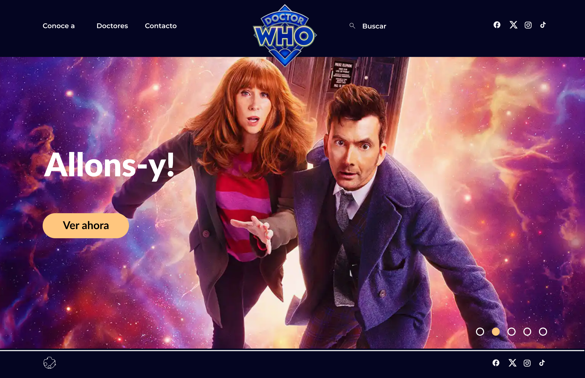
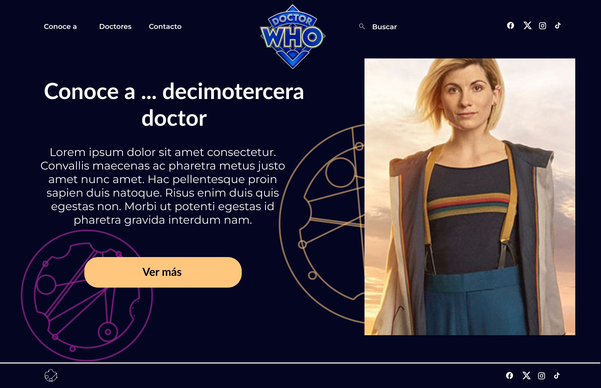
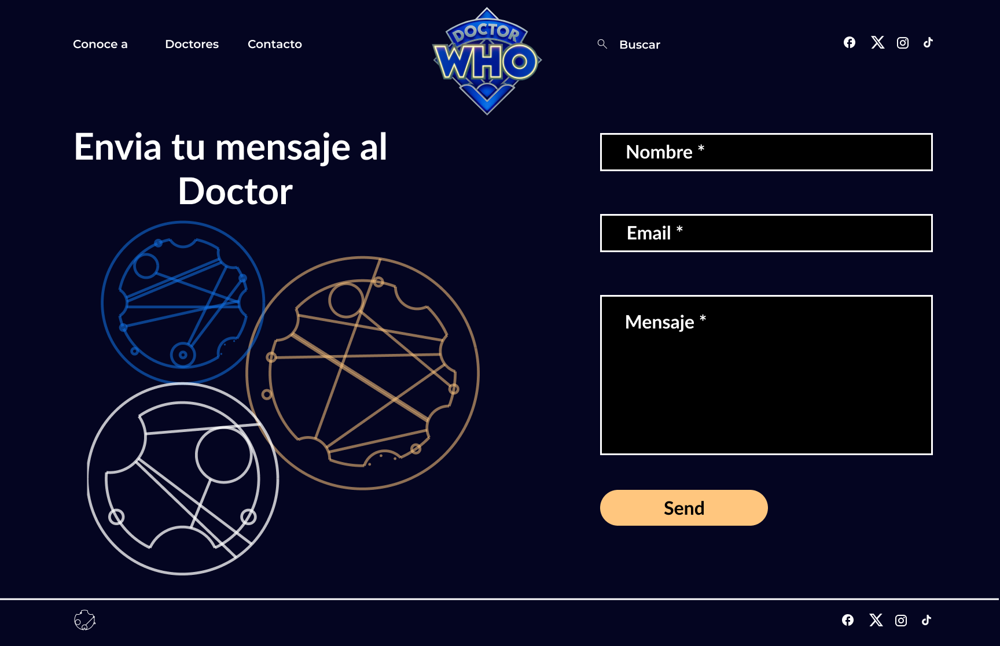

# Doctor Who con React Next.js

> 👀 This project is a web application made with React.js and Next.js.
Doctor Who is a British science fiction television series broadcast by the BBC since 1963.

## 📓 Installation

To run this project locally, you will need NodeJS installed on your machine along with npm package.The app works on the following operating systems: Windows, Linux and macOS.

1. Clone the repository on your computer:

```git clone 'https://github.com/Thazet/ejercicio-react.git'```

2. Get into the project's folder:

```cd REACT-DOCTORWHO```

3. Install dependencies:

```npm install```

4. Run the server:

```npm run dev```

Open [http://localhost:3000](http://localhost:3000) with your browser to see the app's contents. 


## 🛠 Tools

- 
- 
- 
- 

**[Mockup](https://www.figma.com/file/rdW0yacdnv7kOhS1CmD9xf/Proyecto-Doctor-Who?type=design&node-id=0%3A1&mode=design&t=huomGaIOBNlk4KvX-1)**


**[Trello](https://trello.com/b/gbqwzLPx/doctor-who)**


## Preview

### Homepage



### Get to know 



### Doctor's page


### Contact page



## Learn More about NEXT JS

To learn more about Next.js, take a look at the following resources:

- [Next.js Documentation](https://nextjs.org/docs) - learn about Next.js features and API.
- [Learn Next.js](https://nextjs.org/learn) - an interactive Next.js tutorial.

You can check out [the Next.js GitHub repository](https://github.com/vercel/next.js/) - your feedback and contributions are welcome!

## Deploy on Vercel

The easiest way to deploy your Next.js app is to use the [Vercel Platform](https://vercel.com/new?utm_medium=default-template&filter=next.js&utm_source=create-next-app&utm_campaign=create-next-app-readme) from the creators of Next.js.

Check out our [Next.js deployment documentation](https://nextjs.org/docs/deployment) for more details.

## Licencia 

- Este proyecto está bajo la licencia MIT.


